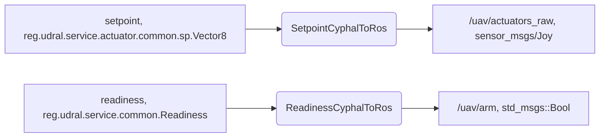
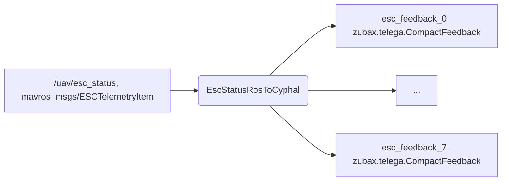
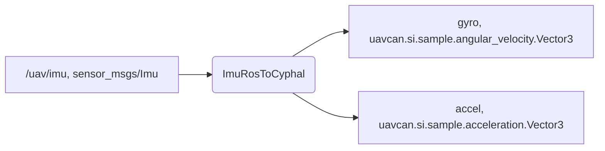
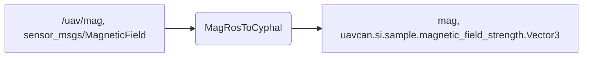
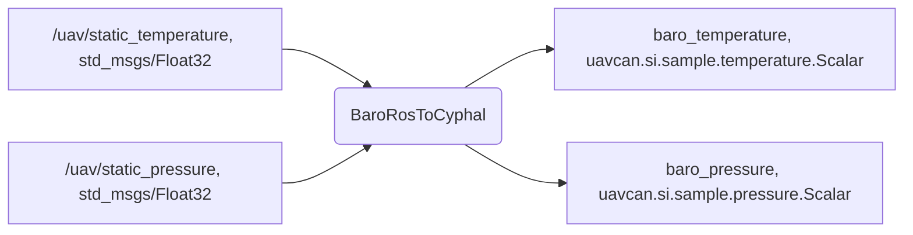
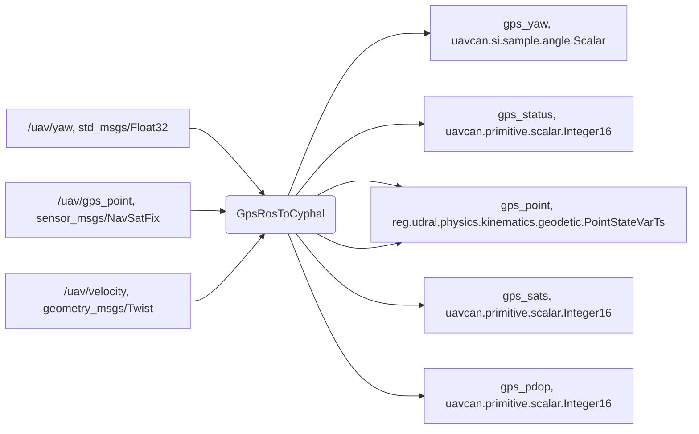
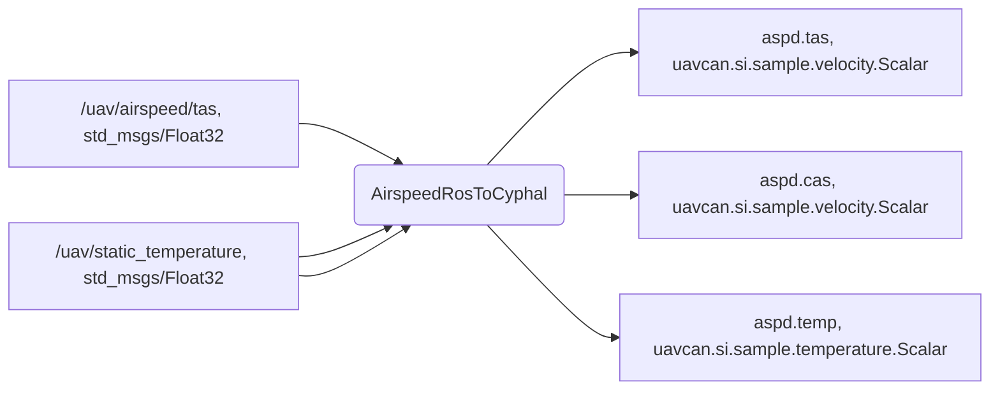
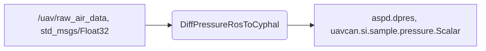
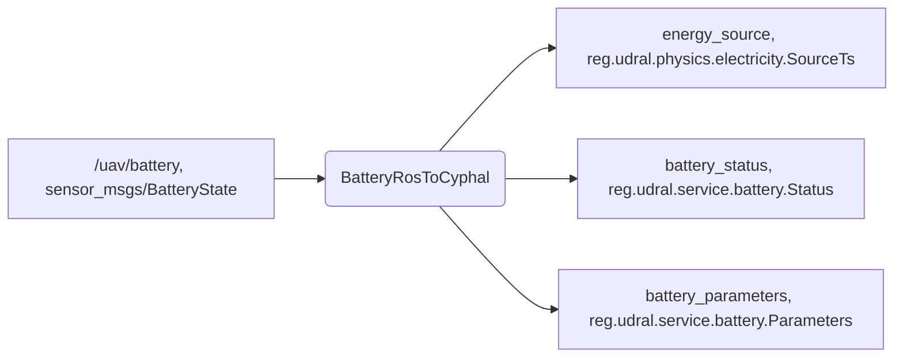
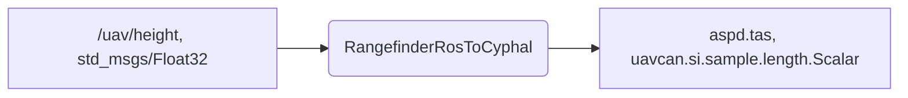

# Cyphal communicator

Cyphal communicator is a ROS package that connects the Cyphal HITL autopilot interface and a simulator interface (based on ROS, ArduPilot JSON, etc).

**Purpose**

The Cyphal communicator is primailry intended for ArduPilot/PX4 Cyphal HITL simulation, but it can be used for other purposes as well.

**Minimal technical requirements**

- Communicator node: ROS-noetic, ubuntu 20.04
- Autopilot hardware: CUAV V5+
- CAN-sniffer: handle at least 2500 CAN frames/sec

## Content

  - [1. Communicator Cyphal and ROS Interfaces](#1-communicator-cyphal-and-ros-interfaces)
    - [1.1. Minimal quadcopter interface](#11-minimal-quadcopter-interface)
    - [1.2. Extended interface](#12-extended-interface)
  - [2. PX4 Cyphal interface](#2-px4-cyphal-interface)
  - [3. Redundancy](#3-redundancy)
  - [4. Installation](#4-installation)
  - [5. Running](#5-running)
  - [6. Usage example](#6-usage-example)

## 1. Communicator Cyphal and ROS Interfaces

The node has the following Cyphal interface:


### 1.1. Minimal quadcopter interface

The following Cyphal interface is supported for a minimal quadrotor application:

**1. Actuator**

Cyphal interface:

| Interface | Communicator's Port | Message |
| --------- | ---- | ------- |
| [udral/actuator](https://github.com/OpenCyphal/public_regulated_data_types/tree/master/reg/udral/service/actuator) | sub.setpoint </br> sub.readiness </br> pub.feedback | [udral.service.actuator.common.sp.Vector31](https://github.com/OpenCyphal/public_regulated_data_types/blob/master/reg/udral/service/actuator/common/sp/Vector31.0.1.dsdl) </br> [reg.udral.service.common.Readiness](https://github.com/OpenCyphal/public_regulated_data_types/blob/master/reg/udral/service/common/Readiness.0.1.dsdl) </br> [zubax.telega.CompactFeedback](https://github.com/Zubax/zubax_dsdl/blob/master/zubax/telega/CompactFeedback.1.0.dsdl) |

ROS-interface for necessary setpoint and readiness:



ROS-interface for auxilliary ESC feedback:



**2. IMU**

Cyphal interface:

| Interface | Communicator's Port | Message |
| --------- | ---- | ------- |
| imu | pub.accelerometer </br> pub.gyro | [uavcan.si.sample.acceleration.Vector3](https://github.com/OpenCyphal/public_regulated_data_types/blob/master/uavcan/si/sample/acceleration/Vector3.1.0.dsdl) </br> [uavcan.si.sample.angular_velocity.Vector3](https://github.com/OpenCyphal/public_regulated_data_types/blob/master/uavcan/si/sample/angular_velocity/Vector3.1.0.dsdl) |

ROS-interface:



**3. Magnetometer**

Cyphal interface:

| Interface | Communicator's Port | Message |
| --------- | ---- | ------- |
| Magnetometer | pub.mag | [uavcan.si.sample.magnetic_field_strength.Vector3](https://github.com/OpenCyphal/public_regulated_data_types/blob/master/uavcan/si/sample/magnetic_field_strength/Vector3.1.0.dsdl) |

ROS-interface:



**4. Barometer**

Cyphal interface:

| Interface | Communicator's Port | Message |
| --------- | ---- | ------- |
| Barometer | pub.pressure </br> pub.temperature | [uavcan.si.sample.pressure.Scalar](https://github.com/OpenCyphal/public_regulated_data_types/blob/master/uavcan/si/sample/pressure/Scalar.1.0.dsdl) </br> [uavcan.si.sample.temperature.Scalar](https://github.com/OpenCyphal/public_regulated_data_types/blob/master/uavcan/si/sample/temperature/Scalar.1.0.dsdl) |

ROS-interface:



**5. GNSS**

Cyphal interface:

| Interface | Communicator's Port | Message |
| --------- | ---- | ------- |
| [udral/gnss](https://nunaweb.opencyphal.org/api/storage/docs/docs/reg/index.html#reg_drone_service_gnss) | pub.point </br> pub.status </br> pub.sats </br> pub.pdop | [reg.udral.physics.kinematics.geodetic.PointStateVarTs](https://github.com/OpenCyphal/public_regulated_data_types/blob/master/reg/udral/physics/kinematics/geodetic/PointStateVarTs.0.1.dsdl) </br> [uavcan.primitive.scalar.Integer16](https://github.com/OpenCyphal/public_regulated_data_types/blob/master/uavcan/primitive/scalar/Integer16.1.0.dsdl) </br> [uavcan.primitive.scalar.Integer16](https://github.com/OpenCyphal/public_regulated_data_types/blob/master/uavcan/primitive/scalar/Integer16.1.0.dsdl) </br> [uavcan.primitive.scalar.Integer16](https://github.com/OpenCyphal/public_regulated_data_types/blob/master/uavcan/primitive/scalar/Integer16.1.0.dsdl) |

ROS-interface:



### 1.2. Extended interface

The following Cyphal allows to run VTOL application and add a few auxilliary features:

**6. RGB LED**

Cyphal interface:

| Interface | Communicator's Port | Message |
| --------- | ---- | ------- |
| Udral/rgbled | sub.rgbled | [reg.udral.physics.optics.HighColor](https://github.com/OpenCyphal/public_regulated_data_types/blob/master/reg/udral/physics/optics/HighColor.0.1.dsdl) |

> ROS-interface not supported yet

**7. Airspeed (including Differential Pressure)**

Cyphal interface:

| Interface | Communicator's Port | Message |
| --------- | ---- | ------- |
| [udral/airspeed](https://nunaweb.opencyphal.org/api/storage/docs/docs/reg/index.html#reg_drone_service_air_data_computer) | pub.aspd.cas </br> pub.aspd.tas </br> pub.aspd.dpres </br> pub.aspd.temperature | [uavcan.si.sample.velocity.Scalar](https://github.com/OpenCyphal/public_regulated_data_types/blob/master/uavcan/si/sample/velocity/Scalar.1.0.dsdl) </br> [uavcan.si.sample.velocity.Scalar](https://github.com/OpenCyphal/public_regulated_data_types/blob/master/uavcan/si/sample/velocity/Scalar.1.0.dsdl) </br> [uavcan.si.sample.pressure.Scalar](https://github.com/OpenCyphal/public_regulated_data_types/blob/master/uavcan/si/sample/pressure/Scalar.1.0.dsdl) </br> [uavcan.si.sample.temperature.Scalar](https://github.com/OpenCyphal/public_regulated_data_types/blob/master/uavcan/si/sample/temperature/Scalar.1.0.dsdl) |

ROS-interface for Airspeed:



ROS-interface for Differential Pressure:



**8. Battery**

Cyphal interface:

| Interface | Communicator's Port | Message | Rate |
| --------- | ---- | ------- | ---- |
| [Udral/Battery](https://nunaweb.opencyphal.org/api/storage/docs/docs/reg/index.html#reg_drone_service_battery) | pub.energy_source </br> pub.battery_status </br> pub.battery_parameters | [reg.udral.physics.electricity.SourceTs](https://github.com/OpenCyphal/public_regulated_data_types/blob/master/reg/udral/physics/electricity/SourceTs.0.1.dsdl) </br> [reg.udral.service.battery.Status](https://github.com/OpenCyphal/public_regulated_data_types/blob/master/reg/udral/service/battery/Status.0.2.dsdl) </br> [reg.udral.service.battery.Parameters](https://github.com/OpenCyphal/public_regulated_data_types/blob/master/reg/udral/service/battery/Parameters.0.3.dsdl) | 1...100 </br> ~1 </br> ~0.2 |

ROS-interface:



**9. Rangefinder**

Cyphal interface:

| Interface | Communicator's Port | Message | Rate |
| --------- | ---- | ------- | ---- |
| Rangefinder | pub.range | [uavcan.si.sample.length.Scalar](https://github.com/OpenCyphal/public_regulated_data_types/blob/master/uavcan/si/sample/length/Scalar.1.0.dsdl) | |

ROS-interface:



## 2. PX4 Cyphal interface


**1. Actuator**

Cyphal interface:

| Interface | PX4's Port | Message |
| --------- | ---- | ------- |
| [udral/actuator](https://github.com/OpenCyphal/public_regulated_data_types/tree/master/reg/udral/service/actuator) | pub.udral.esc.0 </br> pub.udral.readiness.0 </br> sub.udral.feedback.0 </br> ... </br> sub.udral.feedback.7 | [udral.service.actuator.common.sp.Vector31](https://github.com/OpenCyphal/public_regulated_data_types/blob/master/reg/udral/service/actuator/common/sp/Vector31.0.1.dsdl) </br> [reg.udral.service.common.Readiness](https://github.com/OpenCyphal/public_regulated_data_types/blob/master/reg/udral/service/common/Readiness.0.1.dsdl) </br> </br> [zubax.telega.CompactFeedback](https://github.com/Zubax/zubax_dsdl/blob/master/zubax/telega/CompactFeedback.1.0.dsdl) </br> . |

Related PX4 parameters:

| Name | Description |
| ---- | ----------- |
| UCAN1_ESC_PUB  | Cyphal ESC publication port ID |
| UCAN1_READ_PUB | Cyphal ESC readiness publication port ID |
| UCAN1_FB0_SUB  | Cyphal ESC 0 zubax feedback port ID |
| ...  | ... |
| UCAN1_FB7_SUB  | Cyphal ESC 7 zubax feedback port ID |

> On PX4 side actuators logic is implemented within [UavcanEscController, ReadinessPublisher and UavcanEscFeedbackSubscriber drivers](https://github.com/ZilantRobotics/PX4-Autopilot/blob/cyphal-hitl/src/drivers/cyphal/Actuators/EscClient.hpp).

**2. IMU**

Cyphal interface:

| Interface | PX4's Port | Message |
| --------- | ---- | ------- |
| imu | sub.udral.imu.0 </br> sub.udral.imu.accel.0 </br> sub.udral.imu.gyro.0 | [uavcan.primitive.array.Real16.1.0](https://github.com/OpenCyphal/public_regulated_data_types/blob/master/uavcan/primitive/array/Real16.1.0.dsdl) </br> [uavcan.si.sample.acceleration.Vector3](https://github.com/OpenCyphal/public_regulated_data_types/blob/master/uavcan/si/sample/acceleration/Vector3.1.0.dsdl) </br> [uavcan.si.sample.angular_velocity.Vector3](https://github.com/OpenCyphal/public_regulated_data_types/blob/master/uavcan/si/sample/angular_velocity/Vector3.1.0.dsdl) |

Related PX4 parameters:

| Name | Description |
| ---- | ----------- |
| UCAN1_IMU_SUB | Udral IMU 0 subscription port ID |
| UCAN1_ACCEL_SUB | Udral Accelerometer 0 subscription port ID |
| UCAN1_GYRO_SUB | Udral Gyroscope 0 subscription port ID |

> On PX4 side IMU logic is implemented within [UavcanAccelerometerSubscriber](https://github.com/ZilantRobotics/PX4-Autopilot/blob/cyphal-hitl/src/drivers/cyphal/Subscribers/udral/Accelerometer.hpp) and [UavcanGyroscopeSubscriber](https://github.com/ZilantRobotics/PX4-Autopilot/blob/cyphal-hitl/src/drivers/cyphal/Subscribers/udral/Gyroscope.hpp) drivers.

**3. Magnetometer**

Cyphal interface:

| Interface | Communicator's Port | Message |
| --------- | ---- | ------- |
| Magnetometer | sub.udral.mag.0 | [uavcan.si.sample.magnetic_field_strength.Vector3](https://github.com/OpenCyphal/public_regulated_data_types/blob/master/uavcan/si/sample/magnetic_field_strength/Vector3.1.0.dsdl) |

Related PX4 parameters:

| Name | Description |
| ---- | ----------- |
| UCAN1_MAG_SUB | Udral Magnetometer 0 subscription port ID |

> On PX4 side IMU logic is implemented within [UavcanMagnetometerSubscriber](https://github.com/ZilantRobotics/PX4-Autopilot/blob/cyphal-hitl/src/drivers/cyphal/Subscribers/udral/Magnetometer.hpp) driver.

**4. Barometer**

Cyphal interface:

| Interface | Communicator's Port | Message |
| --------- | ---- | ------- |
| Barometer | sub.baro.pressure.0 </br> sub.baro.temperature.0 | [uavcan.si.sample.pressure.Scalar](https://github.com/OpenCyphal/public_regulated_data_types/blob/master/uavcan/si/sample/pressure/Scalar.1.0.dsdl) </br> [uavcan.si.sample.temperature.Scalar](https://github.com/OpenCyphal/public_regulated_data_types/blob/master/uavcan/si/sample/temperature/Scalar.1.0.dsdl) |

Related PX4 parameters:

| Name | Description |
| ---- | ----------- |
| UCAN1_BAROP0_SUB | Barometer 0 pressure subscription ID |
| UCAN1_BAROT0_SUB | Barometer 0 temperature subscription ID |

> On PX4 side IMU logic is implemented within [UavcanBarometerSubscriber](https://github.com/ZilantRobotics/PX4-Autopilot/blob/cyphal-hitl/src/drivers/cyphal/Subscribers/udral/Barometer.hpp) driver.

**5. GNSS**

Cyphal interface:

| Interface | Communicator's Port | Message |
| --------- | ---- | ------- |
| [udral/gnss](https://nunaweb.opencyphal.org/api/storage/docs/docs/reg/index.html#reg_drone_service_gnss) | sub.gps.point.0 </br> sub.gps.status.0 </br> sub.gps.sats.0 </br> sub.gps.pdop.0 | [reg.udral.physics.kinematics.geodetic.PointStateVarTs](https://github.com/OpenCyphal/public_regulated_data_types/blob/master/reg/udral/physics/kinematics/geodetic/PointStateVarTs.0.1.dsdl) </br> [uavcan.primitive.scalar.Integer16](https://github.com/OpenCyphal/public_regulated_data_types/blob/master/uavcan/primitive/scalar/Integer16.1.0.dsdl) </br> [uavcan.primitive.scalar.Integer16](https://github.com/OpenCyphal/public_regulated_data_types/blob/master/uavcan/primitive/scalar/Integer16.1.0.dsdl) </br> [uavcan.primitive.scalar.Integer16](https://github.com/OpenCyphal/public_regulated_data_types/blob/master/uavcan/primitive/scalar/Integer16.1.0.dsdl) |

Related PX4 parameters:

| Name | Description |
| ---- | ----------- |
| UCAN1_GPS0_SUB | GPS 0 subscription port ID |
| UCAN1_GPSPD0_SUB | GPS 0 pdop subscription port ID |
| UCAN1_GPSSA0_SUB | GPS 0 sats subscription port ID |
| UCAN1_GPSST0_SUB | GPS 0 status subscription port ID |

> On PX4 side GNSS logic is implemented within [UavcanGnssSubscriber](https://github.com/ZilantRobotics/PX4-Autopilot/blob/cyphal-hitl/src/drivers/cyphal/Subscribers/udral/Gnss.hpp) driver.

**6. RGB LED**

Cyphal interface:

| Interface | Communicator's Port | Message |
| --------- | ---- | ------- |
| Udral/rgbled | pub.udral.rgbled.0 | [reg.udral.physics.optics.HighColor](https://github.com/OpenCyphal/public_regulated_data_types/blob/master/reg/udral/physics/optics/HighColor.0.1.dsdl) |

Related PX4 parameters:

| Name | Description |
| ---- | ----------- |
| UCAN1_RGBLED_PUB | Cyphal RGB Controller port ID |

On PX4 side RGB LED logic is implemented within [RGBControllerPublisher](https://github.com/ZilantRobotics/PX4-Autopilot/blob/cyphal-hitl/src/drivers/cyphal/Publishers/udral/RGBController.hpp) driver.

**7. Airspeed (including Differential Pressure)**

Cyphal interface:

| Interface | Communicator's Port | Message |
| --------- | ---- | ------- |
| [udral/airspeed](https://nunaweb.opencyphal.org/api/storage/docs/docs/reg/index.html#reg_drone_service_air_data_computer) | sub.udral.aspd.cas.0 </br> sub.udral.aspd.tas.0 </br> sub.udral.aspd.dpres.0 </br> sub.udral.aspd.temperature.0 | [uavcan.si.sample.velocity.Scalar](https://github.com/OpenCyphal/public_regulated_data_types/blob/master/uavcan/si/sample/velocity/Scalar.1.0.dsdl) </br> [uavcan.si.sample.velocity.Scalar](https://github.com/OpenCyphal/public_regulated_data_types/blob/master/uavcan/si/sample/velocity/Scalar.1.0.dsdl) </br> [uavcan.si.sample.pressure.Scalar](https://github.com/OpenCyphal/public_regulated_data_types/blob/master/uavcan/si/sample/pressure/Scalar.1.0.dsdl) </br> [uavcan.si.sample.temperature.Scalar](https://github.com/OpenCyphal/public_regulated_data_types/blob/master/uavcan/si/sample/temperature/Scalar.1.0.dsdl) |

| Name | Description |
| ---- | ----------- |
| UCAN1_ATAS0_SUB | Udral Airspeed TAS 0 subscription port ID |
| UCAN1_ACAS0_SUB | Udral Airspeed CAS 0 subscription port ID |
| UCAN1_ATEM0_SUB | Udral Airspeed Temperature 0 subscription port ID |

> On PX4 side Airspeed logic is implemented within [UavcanAirspeedSubscriber](https://github.com/ZilantRobotics/PX4-Autopilot/blob/cyphal-hitl/src/drivers/cyphal/Subscribers/udral/Airspeed.hpp) driver.


| Name | Description |
| ---- | ----------- |
| UCAN1_DPRES0_SUB | UDRAL Differential pressure 0 subscription ID |
| UCAN1_DPRES1_SUB | UDRAL Differential pressure 0  subscription ID |

> On PX4 side Differential Pressure logic is implemented within [UavcanDiffPressureSubscriber](https://github.com/ZilantRobotics/PX4-Autopilot/blob/cyphal-hitl/src/drivers/cyphal/Subscribers/udral/DifferentialPressure.hpp) driver.

**8. Battery**

Cyphal interface:

| Interface | Communicator's Port | Message | Rate |
| --------- | ---- | ------- | ---- |
| [Udral/Battery](https://nunaweb.opencyphal.org/api/storage/docs/docs/reg/index.html#reg_drone_service_battery) | sub.udral.energy_source.0 </br> sub.udral.battery_status.0 </br> sub.udral.battery_parameters.0 | [reg.udral.physics.electricity.SourceTs](https://github.com/OpenCyphal/public_regulated_data_types/blob/master/reg/udral/physics/electricity/SourceTs.0.1.dsdl) </br> [reg.udral.service.battery.Status](https://github.com/OpenCyphal/public_regulated_data_types/blob/master/reg/udral/service/battery/Status.0.2.dsdl) </br> [reg.udral.service.battery.Parameters](https://github.com/OpenCyphal/public_regulated_data_types/blob/master/reg/udral/service/battery/Parameters.0.3.dsdl) | 1...100 </br> ~1 </br> ~0.2 |

Related PX4 parameters:

| Name | Description |
| ---- | ----------- |
| UCAN1_BMS_BP_SUB | UDRAL battery paramteters source subscription ID |
| UCAN1_BMS_BS_SUB | UDRAL battery status source subscription ID |
| UCAN1_BMS_ESC_SUB | UDRAL battery energy source subscription ID |

> On PX4 side Battery logic is implemented within [UavcanBmsSubscriber](https://github.com/ZilantRobotics/PX4-Autopilot/blob/cyphal-hitl/src/drivers/cyphal/Subscribers/udral/Battery.hpp) driver.

**9. Rangefinder**

Cyphal interface:

| Interface | PX4's Port | Message |
| --------- | ---------- | ------- |
| Rangefinder | sub.udral.range.0 | [uavcan.si.sample.length.Scalar](https://github.com/OpenCyphal/public_regulated_data_types/blob/master/uavcan/si/sample/length/Scalar.1.0.dsdl) |

> On PX4 side Rangefinder logic is implemented within [RangefinderSubscriber](https://github.com/ZilantRobotics/PX4-Autopilot/blob/cyphal-hitl/src/drivers/cyphal/Subscribers/udral/Rangefinder.hpp) driver.


## 3. Redundancy

Cyphal/CAN communication allows to provide a few options of redundancy implementation.

**Firstly**, it allows multiple instances of sensors to be used. While the number of UART/I2C sensors connected to an autopilot is limited by the number of physical connectors on the autopilot, you are free to use multiple sensors on the CAN-bus: 2 GNSS sensors, 2 airspeed sensors, multiple rangefinders and navigation lights distributed around the vehicle and controlled by the autopilot - these are perfectly fine.

At the moment, the cyphal communicator and [the custom branch of PX4-Autopilot](https://github.com/ZilantRobotics/PX4-Autopilot/blob/cyphal-hitl/src/drivers/cyphal) supports 2 airspeed (differential pressure) sensors to demonstate this possibility and test it. You are free to extend it by adding an additional subject.

**Secondly**, redundancy can be provided by designing an UAV with more motors than the minimum required for flight. If one motor fails, the remaining motors can compensate for the loss of thrust, allowing the vehicle to maintain stability and control. One common approach is to build a hexacopter (six motors) or an octocopter (eight motors) instead of a quadcopter (four motors). With additional motors, the quadcopter can continue to fly even if one or more motors fail.

At the moment, Cyphal communicator as well as Cyphal/UDRAL are limited by 31 motors, though this number can be increased by using an additional control group or extending UDRAL specification. PX4 are limited by 16 motors, that is enough for most of the applications.

As an example, HITL simulator supports octocopter airframe to demostrate this possibility.

**Thirdly**, the redundancy can be provided by using an additional physical interface (transport layer). It can be second or third CAN-bus, or even another interface such as Cyphal/Serial or Cyphal/UDP.

The cyphal communicator allows to use multiple interfaces. By default it is based on vitual CAN-interface with name `slcan0`. You can specify another number of the interface and run an additional instance. PX4 capabilities are based on the specific hardware, but modern versions of the hardware typically have 2 CAN-buses.

## 4. Installation

Build the package as usual ROS package with `catkin build`. It will automatically compile DSDL at the build time with [compile_dsdl.sh](compile_dsdl.sh) script.

Before running the communicator, you need to do 3 things:
1. Create virtual CAN. It is expected that you are using CAN-sniffer device such as [UAVCAN sniffer and programmer](https://docs.raccoonlab.co/guide/programmer_sniffer/). An example of script that creates SLCAN is [scripts/create_slcan.sh](scripts/create_slcan.sh). This script automatically detect a connected device and create `slcan0` port. You should create virtual CAN once after each sniffer connection to your PC.
2. Configure environment variables. This step is required for setting subjects port id and few pathes. As an example, you can run `source scripts/config.sh`. You should call this script in each shell session.

After these steps you are able to run the communicator.

## 5. Running

You should connect a CAN-sniffer to an autopilot as shown below:


You should create slcan0.

Then run the communicator using the launch file:

```
roslaunch cyphal_communicator cyphal_communicator.launch
```

## 6. Usage example

Below you can see an example of using the cyphal_communicator in conjunction with a VTOL dynamics simulator.

[](https://youtu.be/JmElAwgAoSc)

## 7. LICENSE

The Cyphal Communicator project is licensed under the [GNU General Public License, version 3](LICENSE)
