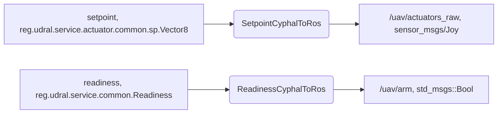
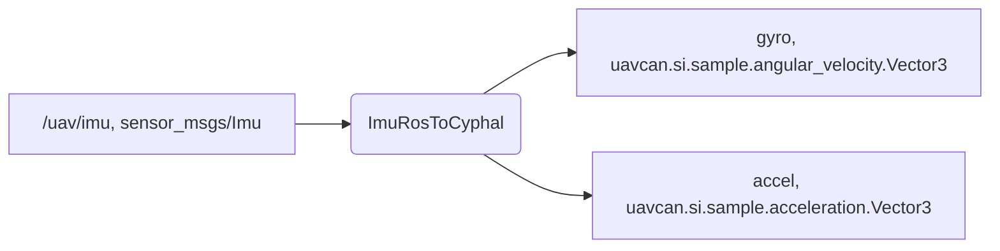
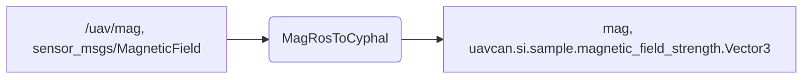
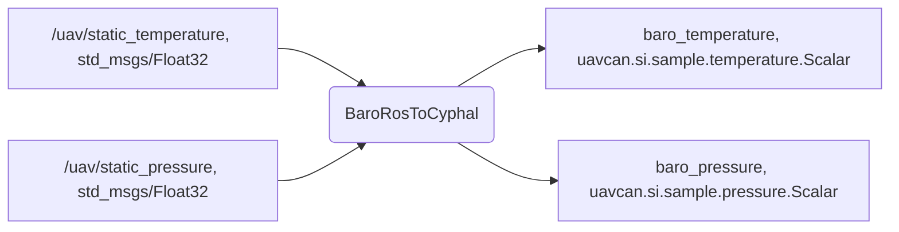
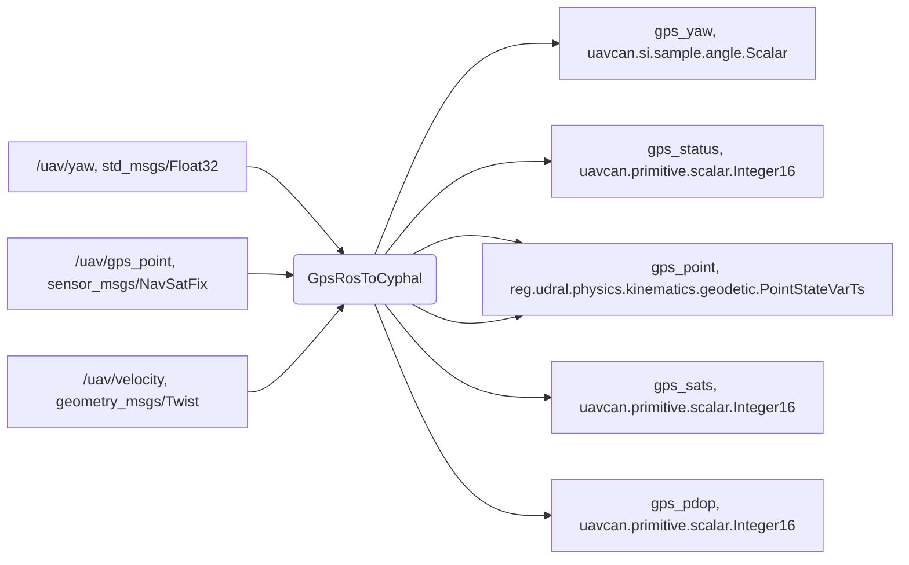
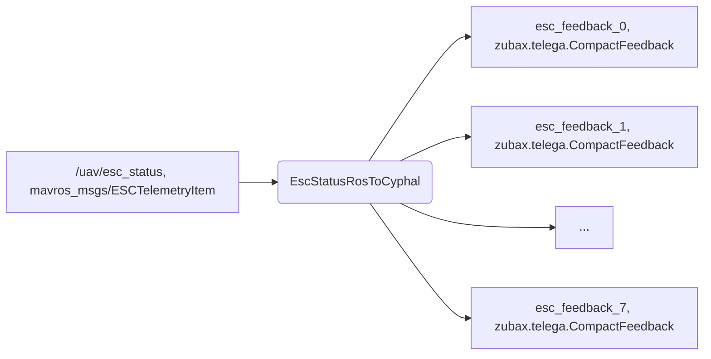

# Cyphal communicator

Cyphal communicator converts Cyphal messages to ROS and vice versa.

It covers a minimal set of sensors required for such applications as Ardupilot/PX4 Cyphal HITL simulation. This communicator can be used for other purposes as well.

For a quadrotor application we should have:
- actuators (ESC),
- gnss,
- barometer,
- magnetometer,
- imu.

For a VTOL application we should additionally have:
- differential pressure sensor or airspeed,

It would be nice to also have:
- rangefinder,
- BMS,
- ESC feedback.

## Content
  - [1. Conversions](#1-conversions)
  - [2. Preparation](#2-preparation)
  - [3. Running](#3-running)
  - [4. Usage example](#4-usage-example)

## 1. Conversions

**CYPHAL->ROS**



> On PX4 side actuators logic is implemented within [UavcanEscController and ReadinessPublisher drivers](https://github.com/ZilantRobotics/PX4-Autopilot/blob/cyphal-hitl/src/drivers/cyphal/Actuators/EscClient.hpp).

**ROS->CYPHAL**

**1. IMU**



> On PX4 side IMU logic is implemented within [UavcanAccelerometerSubscriber](https://github.com/ZilantRobotics/PX4-Autopilot/blob/cyphal-hitl/src/drivers/cyphal/Subscribers/udral/Accelerometer.hpp) and [UavcanGyroscopeSubscriber](https://github.com/ZilantRobotics/PX4-Autopilot/blob/cyphal-hitl/src/drivers/cyphal/Subscribers/udral/Gyroscope.hpp) drivers.

**2. Magnetometer**



> On PX4 side IMU logic is implemented within [UavcanMagnetometerSubscriber](https://github.com/ZilantRobotics/PX4-Autopilot/blob/cyphal-hitl/src/drivers/cyphal/Subscribers/udral/Magnetometer.hpp) driver.

**3. Barometer**



> On PX4 side IMU logic is implemented within [UavcanBarometerSubscriber](https://github.com/ZilantRobotics/PX4-Autopilot/blob/cyphal-hitl/src/drivers/cyphal/Subscribers/udral/Barometer.hpp) driver.

**4. GNSS**



> On PX4 side GNSS logic is implemented within [UavcanGnssSubscriber](https://github.com/ZilantRobotics/PX4-Autopilot/blob/cyphal-hitl/src/drivers/cyphal/Subscribers/udral/Gnss.hpp) driver.

**5. ESC Feedback**



> On PX4 side GNSS logic is implemented within [UavcanEscFeedbackSubscriber](https://github.com/ZilantRobotics/PX4-Autopilot/blob/cyphal-hitl/src/drivers/cyphal/Actuators/EscClient.hpp) driver.


## 2. Preparation

Before running the communicator, you need to do 3 things:
1. Compile DSDL. You can use [compile_dsdl.sh](compile_dsdl.sh) as an example. You should compile it each time after updating DSDL.
2. Create virtual CAN. It is expected that you are using CAN-sniffer device such as [UAVCAN sniffer and programmer](https://github.com/InnopolisAero/inno_uavcan_node_binaries/blob/master/doc/programmer_sniffer/README.md). An example of script that creates SLCAN is [scripts/create_slcan.sh](scripts/create_slcan.sh). This script automatically detect a connected device and create `slcan0` port. You should create virtual CAN once after each sniffer connection to your PC.
3. Configure environment variables. This step is required for setting subjects port id and few pathes. As an example, you can run `source scripts/config.sh`. You should call this script in each shell session.

After these steps you are able to run the communicator.

## 3. Running

It is recommended to run the communicator using launch file as shown below:

```
roslaunch cyphal_communicator cyphal_communicator.launch
```

## 4. Usage example

Below you can see an example of using the cyphal_communicator in conjunction with a VTOL dynamics simulator.

[](https://youtu.be/JmElAwgAoSc)
