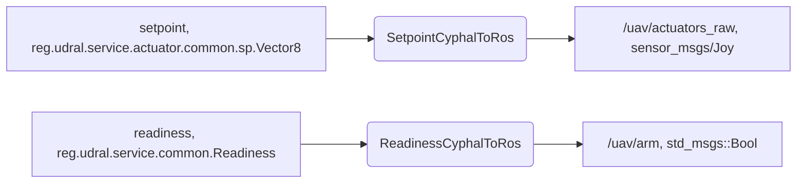
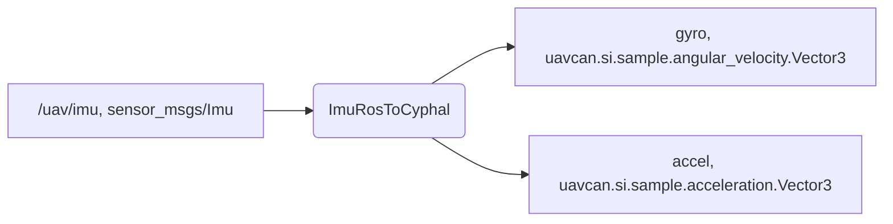
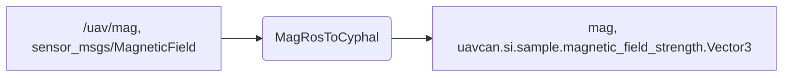
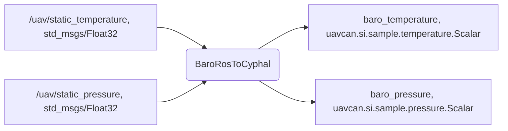
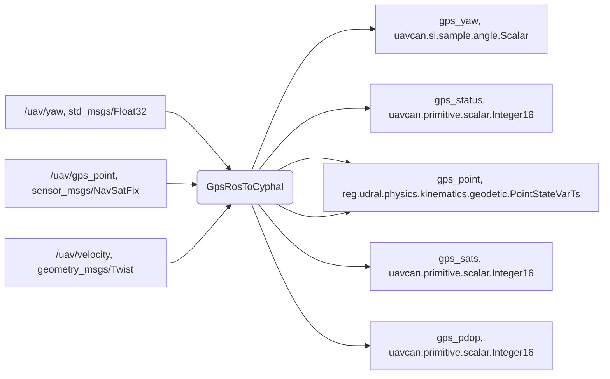
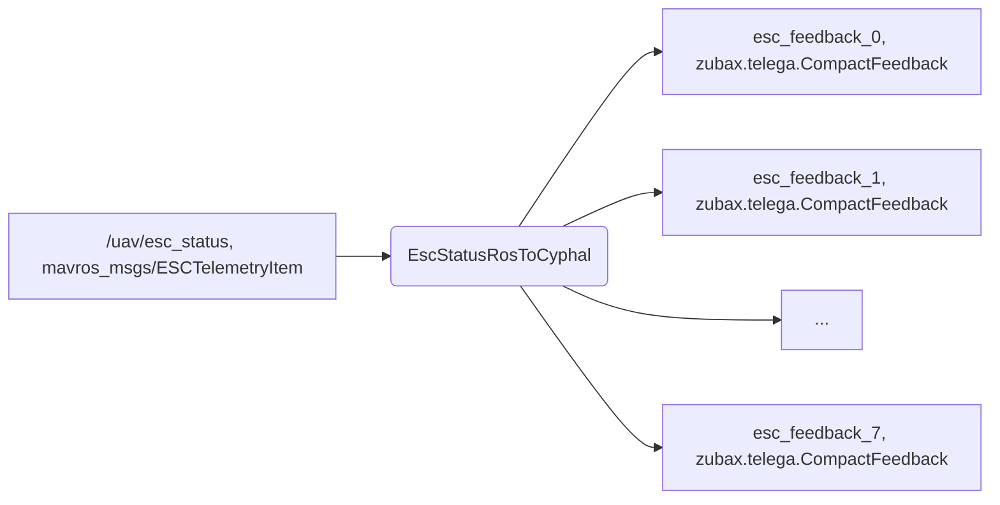

# Cyphal communicator

Cyphal communicator is a ROS package that connects the Cyphal HITL autopilot interface and a simulator interface (based on ROS, ArduPilot JSON, etc). It is primailry intended for ArduPilot/PX4 Cyphal HITL simulation, but it can be used for other purposes as well.

## Content

  - [1. Cyphal interface](#1-cyphal-interface)
  - [2. ROS interface](#1-ros-interface)
  - [3. Installation](#2-installation)
  - [4. Running](#4-running)
  - [5. Usage example](#5-usage-example)

## 1. Cyphal interface

The following Cyphal interface is supported for a minimal quadrotor application:

| № | Interface | Port | Message |
| - | --------- | ---- | ------- |
| 1 | [udral/actuator](https://github.com/OpenCyphal/public_regulated_data_types/tree/master/reg/udral/service/actuator) | sub.setpoint </br> sub.readiness </br> pub.feedback | [Vector31](https://github.com/OpenCyphal/public_regulated_data_types/blob/master/reg/udral/service/actuator/common/sp/Vector31.0.1.dsdl) </br> [Readiness](https://github.com/OpenCyphal/public_regulated_data_types/blob/master/reg/udral/service/common/Readiness.0.1.dsdl) </br> [zubax.CompactFeedback](https://github.com/Zubax/zubax_dsdl/blob/master/zubax/telega/CompactFeedback.1.0.dsdl) |
| 2 | Barometer | pub.pressure </br> pub.temperature | [pressure.Scalar](https://github.com/OpenCyphal/public_regulated_data_types/blob/master/uavcan/si/sample/pressure/Scalar.1.0.dsdl) </br> [temperature.Scalar](https://github.com/OpenCyphal/public_regulated_data_types/blob/master/uavcan/si/sample/temperature/Scalar.1.0.dsdl) |
| 3 | Magnetometer | pub.mag | [magnetic_field_strength.Vector3](https://github.com/OpenCyphal/public_regulated_data_types/blob/master/uavcan/si/sample/magnetic_field_strength/Vector3.1.0.dsdl) |
| 4 | [udral/gnss](https://nunaweb.opencyphal.org/api/storage/docs/docs/reg/index.html#reg_drone_service_gnss) | pub.point </br> pub.status </br> pub.sats </br> pub.pdop | [geodetic.PointStateVarTs](https://github.com/OpenCyphal/public_regulated_data_types/blob/master/reg/udral/physics/kinematics/geodetic/PointStateVarTs.0.1.dsdl) </br> [scalar.Integer16](https://github.com/OpenCyphal/public_regulated_data_types/blob/master/uavcan/primitive/scalar/Integer16.1.0.dsdl) </br> [scalar.Integer16](https://github.com/OpenCyphal/public_regulated_data_types/blob/master/uavcan/primitive/scalar/Integer16.1.0.dsdl) </br> [scalar.Integer16](https://github.com/OpenCyphal/public_regulated_data_types/blob/master/uavcan/primitive/scalar/Integer16.1.0.dsdl) |
| 5 | imu | pub.accelerometer </br> pub.gyro | [acceleration/Vector3](https://github.com/OpenCyphal/public_regulated_data_types/blob/master/uavcan/si/sample/acceleration/Vector3.1.0.dsdl) </br> [angular_velocity/Vector3](https://github.com/OpenCyphal/public_regulated_data_types/blob/master/uavcan/si/sample/angular_velocity/Vector3.1.0.dsdl) |

[todo] For a VTOL application we should additionally have:

| № | Interface | Port | Message |
| - | --------- | ---- | ------- |
| 1 | [udral/airspeed](https://nunaweb.opencyphal.org/api/storage/docs/docs/reg/index.html#reg_drone_service_air_data_computer) | pub.aspd.cas </br> pub.aspd.tas </br> pub.aspd.dpres </br> pub.aspd.temperature | Velocity </br> Velocity </br> [pressure.Scalar](https://github.com/OpenCyphal/public_regulated_data_types/blob/master/uavcan/si/sample/pressure/Scalar.1.0.dsdl) </br> [temperature.Scalar](https://github.com/OpenCyphal/public_regulated_data_types/blob/master/uavcan/si/sample/temperature/Scalar.1.0.dsdl) |

[todo] It would be nice also to have:

| № | Interface | Port | Message |
| - | --------- | ---- | ------- |
| 1 | Rangefinder | pub.range | distance |
| 2 | Battery | ... | ... |


## 1. ROS-interface

**CYPHAL->ROS**



> On PX4 side actuators logic is implemented within [UavcanEscController and ReadinessPublisher drivers](https://github.com/ZilantRobotics/PX4-Autopilot/blob/cyphal-hitl/src/drivers/cyphal/Actuators/EscClient.hpp).

**ROS->CYPHAL**

**1. IMU**



> On PX4 side IMU logic is implemented within [UavcanAccelerometerSubscriber](https://github.com/ZilantRobotics/PX4-Autopilot/blob/cyphal-hitl/src/drivers/cyphal/Subscribers/udral/Accelerometer.hpp) and [UavcanGyroscopeSubscriber](https://github.com/ZilantRobotics/PX4-Autopilot/blob/cyphal-hitl/src/drivers/cyphal/Subscribers/udral/Gyroscope.hpp) drivers.

**2. Magnetometer**



> On PX4 side IMU logic is implemented within [UavcanMagnetometerSubscriber](https://github.com/ZilantRobotics/PX4-Autopilot/blob/cyphal-hitl/src/drivers/cyphal/Subscribers/udral/Magnetometer.hpp) driver.

**3. Barometer**



> On PX4 side IMU logic is implemented within [UavcanBarometerSubscriber](https://github.com/ZilantRobotics/PX4-Autopilot/blob/cyphal-hitl/src/drivers/cyphal/Subscribers/udral/Barometer.hpp) driver.

**4. GNSS**



> On PX4 side GNSS logic is implemented within [UavcanGnssSubscriber](https://github.com/ZilantRobotics/PX4-Autopilot/blob/cyphal-hitl/src/drivers/cyphal/Subscribers/udral/Gnss.hpp) driver.

**5. ESC Feedback**



> On PX4 side GNSS logic is implemented within [UavcanEscFeedbackSubscriber](https://github.com/ZilantRobotics/PX4-Autopilot/blob/cyphal-hitl/src/drivers/cyphal/Actuators/EscClient.hpp) driver.


## 3. Installation

Build the package as usual ROS package with `catkin build`. It will automatically compile DSDL at the build time with [compile_dsdl.sh](compile_dsdl.sh) script.

Before running the communicator, you need to do 3 things:
1. Create virtual CAN. It is expected that you are using CAN-sniffer device such as [UAVCAN sniffer and programmer](https://docs.raccoonlab.co/guide/programmer_sniffer/). An example of script that creates SLCAN is [scripts/create_slcan.sh](scripts/create_slcan.sh). This script automatically detect a connected device and create `slcan0` port. You should create virtual CAN once after each sniffer connection to your PC.
2. Configure environment variables. This step is required for setting subjects port id and few pathes. As an example, you can run `source scripts/config.sh`. You should call this script in each shell session.

After these steps you are able to run the communicator.

## 4. Running

It is recommended to run the communicator using launch file as shown below:

```
roslaunch cyphal_communicator cyphal_communicator.launch
```

## 5. Usage example

Below you can see an example of using the cyphal_communicator in conjunction with a VTOL dynamics simulator.

[](https://youtu.be/JmElAwgAoSc)
