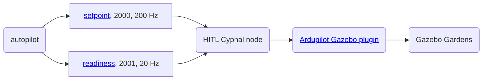
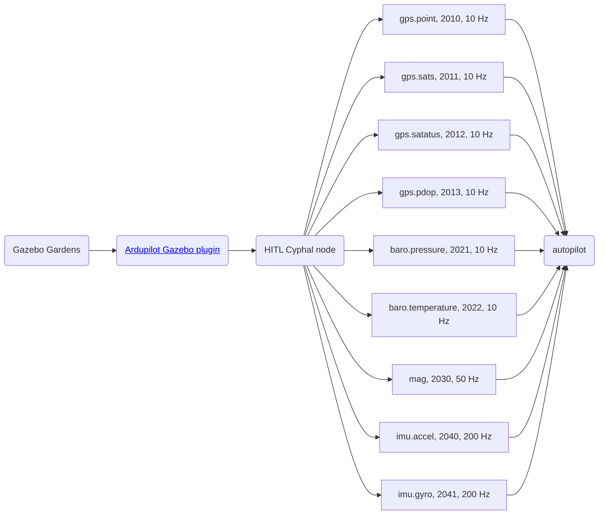

# Ardupilot HITL

## 1. Prerequisites

Hardware:

- ArduPilot compatible autopilot with at least 2 MB flash memory and CAN bus (tested on CUAVv5 and CUAV-X7)
- CAN-sniffer

Software:

- QGC or any other ground control station software,
- Cyphal related utilies such as Yukon, Yakut, nunavut, etc

## 2. Usage

**Step 1. Connect Autopilot and CAN-Sniffer**

A wiring example is shown below:


> At the time of writing, only CAN1 is supported.

**Step 2. Upload Cyphal Ardupilot firmware**

> It is expected that your firmware is based on custom branch [cyphal-hitl](https://github.com/PonomarevDA/ardupilot/tree/cyphal-hitl)

```bash
cd Ardupilot
git checkout cyphal-hitl
./waf configure --board CUAV-X7 # it also tested with CUAVv5
./waf --targets bin/arducopter --upload
```

**Step 3. Configure autopilot and reboot**

Try the following script. It automatically:
- resets the parameters to default and reboots the device,
- then set the necessary parameters to enable Cyphal and disable all onboard sensors, and reboot the device,
- set the Cyphal registers and reboot the device,
- perform force calibration and reboot the last time.

```bash
cd scripts
./ardupilot_gazebo_cyphal_quadcopter.py
```

**Step 4. Run Gazebo**

Install Gazebo Garden and the ArduPilot Gazebo plugin according to [the official ArduPilot instructions](https://ardupilot.org/dev/docs/sitl-with-gazebo.html#sitl-with-gazebo) and run Gazebo Simulator.

```bash
cd ~/gz_ws/src/ardupilot_gazebo
gz sim -v4 -r -s --headless-rendering iris_runway.sdf
```

> It is recommended to use the headless mode because the simulator is very real-time sensitive.

> Other simulators based on the JSON interface may also work, but have not been tested.

**Step 5. Create SLCAN**

An example of how you can create SLCAN:

```bash
source scripts/init.sh
```

> The script was tested only with [RL sniifer](https://docs.raccoonlab.co/guide/programmer_sniffer/)

If you try `ifconfig` it should show `slcan0`.

**Step 6. Run Cyphal HITL application**

```bash
# Clone with submodules!
git clone git@github.com:RaccoonlabDev/cyphal_application.git --recursive
cd cyphal_application

# Generate DSDL
./scripts/nnvg_generate_c_headers.sh

# Build
mkdir -p build/hitl
cd build/hitl
cmake ../../examples/autopilot_hitl && make

# Run
./application
```

**Step 7. Wait until you get a message `EKF3 IMU0 is using GPS` and then fly**

> An autopilot may say "Not ready" when it begins receiving the Cyphal sensor data after initialization is complete. In this case, simply restarting the vehicle will help.

## 3. How does it work?

## 3.1. Actuator command flow



### 3.1. Sensors data flow



### 3.3. Yakut


